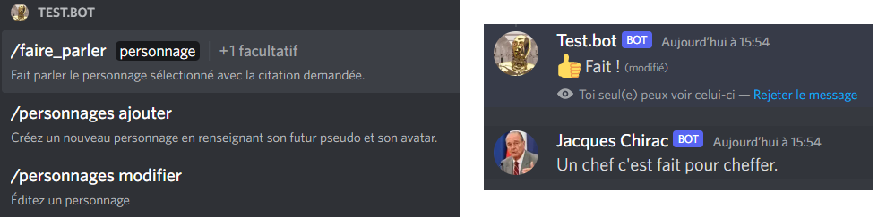

# 🤖🎭 Discord Muppets Bot

Language: 

This is a set of commands enabling your Discord bot to create custom characters in a guild and make them tell custom speeches, defined by users.

## List of commands and features demonstration


## ⚙Config

Your bot must have the following scopes in the guild :

- `bot`, with the permissions below :
  - Manage Webhooks
  - Send Messages
- `application.commands`

You must create in the repository's root directory a `config.json` file following this schema:

```json
{
    "token":"<Your bot token>",
    "clientId":"<Your application id>",
    "guildId":"<The id of the single guild where the bot will run>",
    "commandToDelete_id":"", //Let "" if you don't need it
}
```

You also must create an sqlite `database.db` file, just by once executing the `utils/init_db.ts` (or `utils/init_db.js`) file.

```bash
cd ./src/utils
ts-node init_db.ts
cd ../..
```

OR

```bash
cd ./build/utils
node init_db.js
cd ../..
```

## Run the BOT

### Run MuppetsBot features only

If you want your bot to just use the commands in this repository, executing the `index.ts` script will carry out the job :

In the repository's root directory, first run these lines

```bash
npm install
```

Then, some scripts can be executed, according to the situation of your project.

#### In Development
  
  ```bash
  npm run build
  npm run start
  ```
  
  Or (if you don't want to build in js)
  
  ```bash
  npm run dev
  ```
  
#### In production

  ```bash
  npm run build
  pm2 build/index.js
  ```

### 🧩Incorporating these features in your bot

If you're developing your own typescript or javascript Discord Bot and want to add the Muppets Bot features to your bot's ones, the `index.ts` file describes an example of easy use, but we can sum the methodology up with these instructions :

> I advise to fork the repository in a folder in your project repository. Here is an example of project structure :  
>
> ```bash
> BotProject/
>    main.ts
>    MuppetsBot/
>       src/
>          muppets-client.ts
>          ...
>       ...
>    ...
> ```
>
> Then you can install the dependencies by executing this line in the `BotProject/` folder.
>
> ```bash
> npm install "./MuppetsBot"
> cd MuppetsBot
> npm run build
> ```
>
> *The last line is useless in typescript, but some compilation issues may occur in this language in cause of `tsconfig` params. I haven't try to check that, but using in Javascript the built classes works.*
>
> Then, you must init the commands with this code and make them run like this, thanks to the `initCommandsCollection()` asynchronous method the `MuppetsClient` class provides :
>
> ```ts
> //For instance, in the main.ts file
> import { MuppetsClient } from './Muppets Bot/src/muppets-client';
>
> (async () => {
>    const muppetsClient = new MuppetsClient();
>    await muppetsClient.initCommandsCollection();
>    //You can here import your own commands
>    client.on('interactionCreate', async (i:Interaction) => {
>       muppetsClient.treat(i);
>       //Here you can execute your own commands in addition to the muppetsClient's ones
>    });
> })()
> ```
>
> The process in Javascript is approximately the same.
>
> ```js
> const { Client, GatewayIntentBits, } = require("discord.js");
> const { token, guildId } = require('./config.json');
> const { MuppetsClient } = require('./MuppetsBot/build/muppets-client');
>
> const client = new Client({ intents: [GatewayIntentBits.Guilds] });
>
> (async () => {
>        //Initiating the MuppetClient commands Collection
>        const muppetsClient = new MuppetsClient("fr");
>        await muppetsClient.initCommandsCollection();
>
>        client.on('interactionCreate', async (i) => {
>                //Treating MuppetsClient's commands (if there's one to be treated)
>                muppetsClient.treat(i);
>        });
>        client.on('ready', async () => {
>                console.log('Ready !')
>        })
> })()
> ```

### Delete a command from the guild

This is a manual task (normally useless) which can be carried out by executing the `delete-command.ts` file after having set the `config.json` file with the command id.

## 🌐Internationalization



All the commands names, descriptions, and options are translatable in other languages, according to the system language user has chosen for Discord.

However, the language of BOT's logging messages must be set according to the guild where the BOT is. Therefore, to display another language than english for this kind of content, you must set up the language thanks to a `MuppetsClient` constructor's argument. There is also an asynchronous `changeLanguage` method to do that whenever it should be done (be free to call it for instance in a command changing your bot's language).

```ts
//if nothing is specified, English will be chosen
const muppetsClient = new MuppetsClient('fr');
//...
await muppetsClient.changeLanguage('en-US');
```

### 🇫🇷 🇺🇸 Supported languages

Just French (`"fr"` option) and English (`"en-US"` option) are here supported, but adding other languages is quite easy :

1. In the repository's `/i18n` folder, duplicate the `/en` folder and rename it with the abbreviation of the language you want to add (this abbreviation must be among [the languages Discord supports](https://discord.com/developers/docs/reference#locales)).
2. Then, overwrite each value of `translation.json` file with the sentences in the language to be added (I advise to be careful to keep interpolation in the sentences, if it is present).
