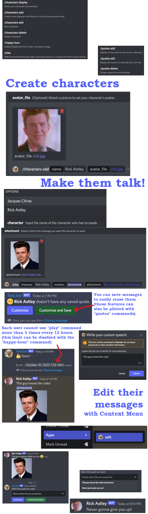

# 🤖🎭 Discord Muppets Bot

Language: 

This is a set of commands enabling your Discord bot to create custom characters in a guild and make them tell custom speeches, defined by users.

## List of commands

For now, names and description are in french, but the internationalization will coming soon.



## Config

First and foremost, run `npm install` in the repository's root directory.

You must create in the repository's root directory a `config.json` file following this schema:

```json
{
    "token":"<Your bot token>",
    "clientId":"<Your application id>",
    "guildId":"<The id of the single guild where the bot will run>",
    "commandToDelete_id":"", //Let "" if you don't need it
}
```

You also must create an sqlite `database.db` file, just by once executing the `utils/init_db.ts` file.

```bash
ts-node utils/init_db.ts
```

**⚠In production :** if you want to compil the typescript project, you must place the database in the built folder. If the database isn't initiated yet, you therefore can run the `utils/init_db.js` script to do that. 

## Run the BOT

### ts-node

If you want your bot to just use the commands in this repository, executing the `index.ts` will carry out the job :

```bash
ts-node index.ts
```

### Incorporating these features in your bot

The `index.ts` file describes an example of use, but we can sum the methodolgy up with these instructions :

> I advise to fork the repository in a folder in your project repository. Here is an example of project structure :  
>
> ```bash
> BotProject/
>    main.ts
>    Muppets Bot/
>       muppets-client.ts
>       ...
>    ...
> ```
>
> Then, you should once get the commands with this code and make them run like this, thanks to the `getCommandsCollection()` asynchronous method the `MuppetsClient` class provides :
> ```ts
> //For instance, in the main.ts file
> import { MuppetsClient } from './Muppets Bot/muppets-client';
>
> async () => {
>    const muppetsClientCommands = await (new MuppetsClient()).getCommandsCollection();
>    client.on('interactionCreate', async (i:Interaction) => {
>       const selectedMuppetCommand = muppetsClientCommands.get(i.commandName);
>       await selectedMuppetCommand?.execute(i);
>    });
> }
> ```

_Please be aware the commands are built and deployed (and even deployed again, sometimes) asynchronously, in addition to be executed in this way. Moreover, the collection contains all commands with an `AsyncBuiltCommand` type I've developed to cleanly use the `MuppetsClient` internal properties. This is why the internal code is quite far from the conventional Discord Bot js and ts programs and you should follow the instructions I've described above. The `MuppetClient` in the `muppet-client.ts` main file has therefore been designed to be easily used in any other Discord projects, like as an extension._

### Delete a command from the guild

This is a manual task (normally useless) which can be carried out by executing the `delete-command.ts` file after having set the `config.json` file with the command id.
